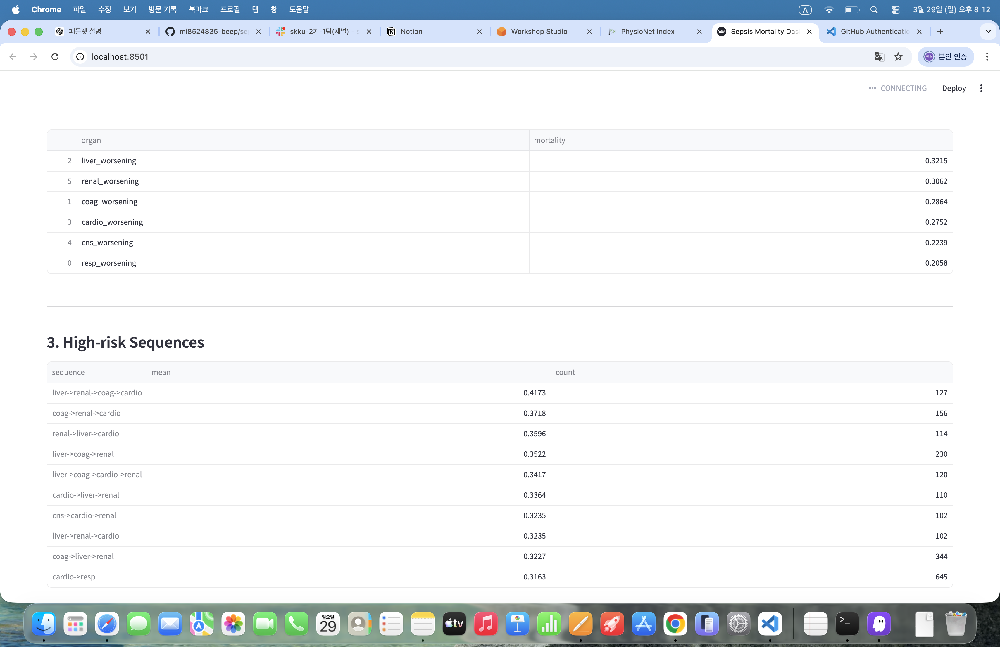

# 🧠 Sepsis Organ Dysfunction Pattern Analysis

## 📌 Overview
Sepsis 환자에서 장기 기능 이상(organ dysfunction)의 개수와 조합(sequence)이 사망률에 미치는 영향을 분석하고, 이를 기반으로 설명 가능한 분석, 예측 모델, 대시보드를 구현한 프로젝트입니다.

## 📊 Dashboard Preview

## 🎯 Objectives
- 장기 dysfunction burden과 mortality 관계 분석
- 장기 악화 sequence별 위험 패턴 탐색
- explainable 분석 기반 dashboard 구현

## 🛠 Data
- MIMIC-IV 기반 sepsis cohort
- SOFA score 기반 organ dysfunction
- Target: hospital_expire_flag

## ⚙️ Method
- organ_count 생성
- sequence 생성 (SOFA 기반 pseudo-order)
- organ count vs mortality 분석
- organ별 mortality 분석
- sequence별 mortality 및 frequency 분석
- XGBoost 기반 mortality prediction
- Streamlit dashboard 구현

## 📊 Key Results
- organ count 증가에 따라 mortality 상승
- high-risk sequence:
  - liver → renal → coag → cardio
  - coag → renal → cardio
  - renal → liver → cardio
- model AUROC ≈ 0.62
- 주요 feature: organ_count, renal, cardiovascular

## 💡 Insights
- 단순 장기 수보다 장기 조합과 pattern이 중요
- 일부 rare sequence가 높은 mortality를 보임
- explainable 분석이 임상적으로 의미 있음

## ⚠️ Limitations
- sequence는 실제 시간 순서가 아닌 pseudo-order
- 단일 데이터셋 기반

## 🔮 Future Work
- time-series 기반 progression 분석
- survival analysis
- real-time risk prediction

## 🧑‍💻 Tech Stack
- Python
- pandas
- scikit-learn
- xgboost
- Streamlit

## 📎 Note
Raw parquet files are not included in this repository due to file size limits and access restrictions.
